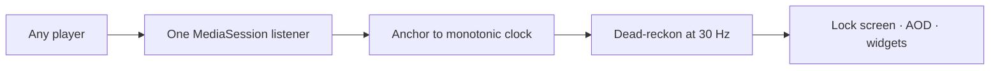

<!--
  github.com/parthahere001/parthahere001 — profile README

  ONE SETUP STEP: add .github/workflows/snake.yml to THIS repo in the same commit.
  The snake image near the bottom fills in ~1 min after you push. Everything else
  renders instantly.
-->

  
  
  

Android in Kotlin. PureScript on a checkout page millions of people pay through. Agent systems that produce finished artifacts instead of demos.

## LyricGlow

**Word-by-word lyrics on your Android lock screen.** Any music player, any phone.

> [!TIP]
> **1,000+ installs in month one. 5,000+ today. Zero spent on ads.**

23,491 lines of Kotlin, 100% Compose, four months, one developer.

<b>How it stays in sync</b>

 

- **Dead-reckoned, not polled.** Position is anchored to `SystemClock.elapsedRealtime()` and extrapolated every frame — exact sync without hammering the player.
- **Word timing is modelled.** LRC gives only line stamps, so sing-time is estimated per character, clamped against the real line window, and scaled so the last word lights *on* the beat.
- **Widgets reuse the lock screen's draw code** through an off-screen `CanvasDrawScope` — no Compose runtime, just a bitmap.
- **Privacy is in the manifest, not the policy.** No `QUERY_ALL_PACKAGES`, no storage or media permissions at all.

  
  

<!--
  NAMING NOTE — read once, then delete.
  "Aarokya" is unannounced Juspay work with no public footprint, so this page would
  be its first public mention. Worth a quick check with your team before pushing.
  To stay anonymous: drop the name from this heading and from the typing banner
  above, and the section still reads fine as "Building now".

  Everything here is intentionally limited to Aarokya's own positioning language —
  no stack, no architecture, no scale numbers.
-->

## Building now: Aarokya

**Consumer-powered healthcare for gig workers.** My main focus at Juspay right now.

Closed source, so this is deliberately all the detail there is — happy to talk about the engineering in a conversation.

## An agent pipeline that makes videos while I sleep

A topic goes in, an upload-ready 1080p video comes out — researched, scripted, narrated, shot, cut and tagged. 26,543 lines of Python, 15 stages, one command.

<b>The hard parts</b>

 

- **No API key anywhere.** Every model call shells out to the Claude Code CLI headless, with a JSON schema as the output contract.
- **Narration never leaves the machine.** Kokoro-82M runs locally on Apple Silicon under a prosody planner that derives rate and pitch from the scene's mood.
- **Relevant, or nothing.** Footage selection may return nothing; an empty pick becomes a typographic card, because a card beats misleading footage.
- **Every run stops at a human gate** with a claims table and source URLs. The editorial pass is a designed step.

## Also at Juspay

I build features on **[Payment Page](https://docs.juspay.in/hyper-checkout/web)** — Juspay's hosted checkout, used by thousands of merchants and reaching millions of people paying for things.

It's written in **PureScript**. Strict purely-functional types, in production, on the checkout screen where a bug is somebody's money. Juspay open-sourced the framework underneath it as [purescript-presto](https://github.com/juspay/purescript-presto).

The repo is private, so there's nothing to link. PureScript, Payment Page and the scale figures are all from Juspay's public docs and marketing.

## Open source you can read

| Repo | What it is |
| :--- | :--- |
| [**exolock**](https://github.com/parthahere001/exolock) | Android app locker. PBKDF2-HMAC-SHA256 at 120,000 iterations, constant-time compare, nothing in plaintext. 41 Kotlin files, zero Java. |
| [**Learner**](https://github.com/parthahere001/Learner) | MIT-licensed Django LMS, written because the one my college used was buggy. |
| [**Local-Music-Player**](https://github.com/parthahere001/Local-Music-Player) | Self-hosted FastAPI music server — ID3 tags, embedded cover art, playlists. |
| [**LottoBit**](https://github.com/parthahere001/LottoBit) | USD-priced ETH lottery in Solidity, tested three ways: mainnet fork, mocks, testnet. |

**20 pull requests authored, 17 merged — 15 into other people's repositories.**

## Stack

  
  
  

<kbd>Coroutines</kbd> <kbd>Solidity</kbd> <kbd>ffmpeg</kbd> <kbd>GitHub Actions</kbd>

<!--
  Stats card points at a COMMUNITY MIRROR on purpose: the canonical
  github-readme-stats.vercel.app is 503 DEPLOYMENT_PAUSED, and both
  github-profile-trophy and github-readme-activity-graph are 402 (disabled).
  If this mirror dies too: fork anuraghazra/github-readme-stats -> import to
  Vercel -> swap the host below.
-->

<b>More stats, and why the byte counts lie</b>

 

 

Three old repos of mine committed their virtualenvs, which alone account for tens of megabytes of "Python". Measured on code I actually wrote, my public GitHub is roughly **33% Kotlin, 19% JavaScript, 15% CSS, 10% Python** — the C and C++ entirely auto-generated Flutter desktop scaffolding.

<!--
  Snake is generated by .github/workflows/snake.yml in THIS repo.
  Blank until the workflow runs (~1 min after push). Delete this block to skip it.
-->
<picture>
  <source media="(prefers-color-scheme: dark)" srcset="https://raw.githubusercontent.com/parthahere001/parthahere001/output/github-snake-purple.svg" />
  <source media="(prefers-color-scheme: light)" srcset="https://raw.githubusercontent.com/parthahere001/parthahere001/output/github-contribution-grid-snake.svg" />
  
</picture>

  &nbsp;
  &nbsp;
  &nbsp;
  &nbsp;
  

**Building something that has to be correct at 3 a.m.? Let's talk.**

