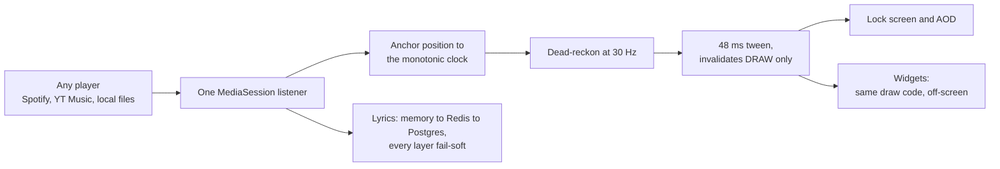

<!--
  github.com/parthahere001/parthahere001 — profile README

  ONE SETUP STEP (takes 60 seconds):
  Add .github/workflows/snake.yml to THIS repo in the same commit as this README.
  The workflow runs on push to main, so the contribution-snake image near the bottom
  fills itself in about a minute after you push. Until it does, that one image is blank.
  Everything else on this page renders the moment you paste it.
-->

  
  
  

<table align="center">
  <tr>
    <td align="center" width="33%"><h3>5,000+</h3><b>installs on Google Play</b></td>
    <td align="center" width="33%"><h3>1,000+</h3><b>in the first month</b></td>
    <td align="center" width="34%"><h3>&#8377;0</h3><b>spent on advertising</b></td>
  </tr>
</table>

**I build products end to end and put them in front of strangers.** Android in Kotlin. Backends in Python and Rust. Agent systems that produce finished artifacts instead of demos. Everything below is either installed on somebody's phone or running unattended tonight.

## Shipped: LyricGlow

**Word-by-word lyrics on your Android lock screen and always-on display.** Every word lights up on the beat, with any music player, on any phone.

> [!TIP]
> **1,000+ installs in the first month. 5,000+ today. Not one rupee spent on ads.**
> None of it was bought. I read each community's posting rules before posting, put solo dev at the top of every thread, and after that people told other people.

Four months old. 23,491 lines of Kotlin across 75 files, 167 composables, 100% Jetpack Compose, one developer.

<b>The engineering underneath it</b>

 

- **Timing is dead-reckoned, not polled.** The media session's reported position is anchored to `SystemClock.elapsedRealtime()`, the same monotonic clock `MediaController` uses for its own update stamp, then extrapolated every frame. Exact sync without hammering the player.
- **The fill runs at two rates.** A 30 Hz logical tick (33 ms playing, 16 ms while scrubbing, 100 ms under battery saver, 500 ms paused) feeds a Compose `Animatable` chased by a 48 ms tween, read only inside the active line's `drawBehind`. The fill glides at display refresh rate and invalidates *draw* only. The list never recomposes on a tick.
- **Word timing is modelled, not guessed.** LRC files only give line timestamps. Sing-time is estimated at roughly 150 ms per character, clamped to 1.2 to 6 seconds, then taken as the MIN against the real line window so a line followed by an instrumental doesn't smear colour across the gap, then scaled by 0.94 so the last word lights *on* the beat instead of after it.
- **The home-screen widgets reuse the lock screen's exact draw code.** A headless renderer drives the same draw functions through an off-screen `CanvasDrawScope`: no Compose runtime, no recomposition, just a bitmap. Eight widget receivers ship from that one renderer.
- **The visualizer is real FFT**, mapped into 36 log-spaced bands with a perceptual dB curve, a high-frequency tilt so bass can't permanently dominate, a squelch that collapses the bars in track gaps, and asymmetric smoothing (0.55 attack, 0.14 decay) so bars snap to the beat without flickering.
- **It fails honestly.** A three-state result separates a genuine lyric miss from an upstream outage, and only real lyrics are ever cached, so one bad minute upstream never freezes into a permanently blank song. Concurrent requests for the same track join a single in-flight `Deferred`, so one caller cancelling can't kill a fetch the others are awaiting.
- **Matching survives messy tags.** A three-pass sweep scores candidates by blending character ratio against token containment. That's what lets a tag reading "Honey Singh" match "Yo Yo Honey Singh" while a genuinely different artist still scores near zero. Candidates are then ranked by Unicode script against the device language, using the presence of kana as the tell that stops Chinese matching Japanese.
- **Real OLED engineering, not a dark theme.** A fixed brightness override on the always-on display, and the entire canvas drifts by ±6dp to mitigate burn-in.
- **Privacy is enforced in the manifest, not promised in a policy.** No `QUERY_ALL_PACKAGES` (a scoped `<queries>` intent enumerates players instead), no storage or media permissions at all, cleartext traffic off, and the microphone requested at runtime only if you opt into the accurate visualizer, with a permission-free fallback if you decline.
- **It works with every player, not five of them.** One listener on the platform `MediaSessionManager`, so Spotify, YouTube Music, Poweramp and local files behave identically. A boot receiver re-binds after reboot because aggressive OEM skins silently drop it, which otherwise left the app inert until reinstall.
- **Releases are automated.** A channel marker in the commit message drives version computation, tagging, and a GitHub Release carrying both AAB and APK. Commit format is enforced in CI on every commit in a PR, so local hooks can't be bypassed. 38 tags across 103 commits.

  
  

Closed source. The Play Store listing and lyricglow.com are the front door.

<!--
  NAMING NOTE — read once, then delete this comment.

  "Aarokya" has no public footprint: it is an unannounced, employer-owned product
  and a web search returns nothing under that name. Naming it here is safe only if
  you're comfortable being the first public mention of it. If you'd rather not be,
  delete this section down to the next gradient rule and paste this instead:

  ## Building now

  A healthcare and insurance benefits platform, and my main focus right now — Rust
  on the backend, React Native on the front, built with a team. Closed source, so
  there's no link here and this is deliberately all the detail there is. Happy to
  walk through the engineering in a conversation.

  **Benefits that behave like software: typed, tested, and boring in production.**
-->

## Building now: Aarokya

> [!NOTE]
> **Aarokya is private.** This is a sketch, not a tour.

A healthcare and insurance benefits platform, and my main focus right now. I'm building and contributing to it alongside a team, and it's the most disciplined codebase I've worked in. It's closed source, so there's no link here and this is deliberately all the detail there is. Happy to walk through the engineering in a conversation.

**Benefits that behave like software: typed, tested, and boring in production.**

## An agent pipeline that makes finished videos while I sleep

A topic goes in. An upload-ready 1080p video comes out: researched, scripted, narrated, shot, cut, thumbnailed and tagged. 26,543 lines of Python across 38 modules, 15 pipeline stages, 30 versioned prompt templates, and a 752-line design doc treated as the authoritative contract. One command produces a whole day's slate.

<b>The hard parts</b>

 

- **No API key anywhere.** Every model call shells out to the Claude Code CLI in headless mode, with a JSON schema as the output contract. One environment variable reroutes the identical contract to a different vendor's CLI, including a rewriter that converts a lenient schema into strict structured output.
- **Concurrency is hand-rolled** because neither primitive was enough alone: N `flock`'d lock files plus an in-process semaphore, since `flock` is per-open-description and doesn't reliably exclude sibling threads, while a bare semaphore can't see other processes. Model calls are capped at 3 (past about 4 they contend and hang at 0% CPU; one batch stalled for 100 minutes). Encodes are capped at `cpu_count // 4` after an unbounded run drove load average to 35.
- **A stall watchdog that can't false-kill.** It only arms once the subprocess has streamed at least one line, then kills the entire session process group, so a wedged call can't leave an orphan holding a concurrency slot.
- **Network-aware pause and resume.** Every network boundary TCP-probes public resolvers on :53 and waits for connectivity instead of spending a retry. Dropped Wi-Fi pauses the pipeline rather than failing it.
- **Narration never leaves the machine.** Kokoro-82M runs locally on Apple Silicon, one sentence at a time, under a deterministic prosody planner that derives rate and pitch from the scene's mood and the sentence's own shape: excited lifts, tense slows, and a short punch line after a long one earns a beat of silence.
- **Captions are word-accurate**, because the TTS word-boundary events are aligned back onto the script's own tokens with a greedy two-pointer over normalised forms, degrading to even distribution when a sentence won't align. One shared cue builder drives both the SRT and the burned-in captions, so the two can never disagree.
- **Relevant, or nothing.** Footage selection is two-phase and explicitly allowed to return nothing. An empty pick becomes a typographic card carrying the scene's own words, because a card beats misleading footage. It replaced blind top-search-result picking that once put forklift-safety signage in a story about chips.
- **"The chart in scene 5 says millions, the data is billions"** becomes a schema-constrained edit plan over nine action types, and only the affected scenes re-render, with dependency-aware dirty tracking because changing narration changes the visual count too.
- **Every run stops at a human gate** that writes out the full narration, a claims table with source URLs to check, and a list of any scene that fell back to a card. The editorial pass is a designed step, not an afterthought.
- **The loop actually closed.** A self-installing collector has accumulated 38,425 append-only measurements across 492 published videos, and those measurements are what rewrote the scheduler's own constants. The code changed because the data said so.
- **An honest caveat.** The offline harness runs the whole produce, fix and finalize chain against fixtures with no network and still renders a playable MP4, including a deterministic offline planner so the repair logic is genuinely exercised. It is a fixture-driven end-to-end harness, not a unit-test suite.

Private repo. Ask me and I'll walk you through it.

## Day job

Production mobile and payments infrastructure at **Juspay**.

I work on the rider and driver apps for **Namma Yatri**, India's first open-source, zero-commission ride-hailing platform, built on the Beckn protocol and ONDC. Publicly reported: 130M+ completed rides, 700K+ drivers onboarded, live in seven cities, reached on roughly $5M against the billions the incumbents burned. The apps are React Native written in **ReScript** and TypeScript, a typed-functional ML dialect compiled to JS, with Kotlin and Swift native modules underneath. The platform core is open source at [nammayatri/nammayatri](https://github.com/nammayatri/nammayatri) (AGPL-3.0); the app repos are not.

I also contribute to Juspay's **Hyper SDK**, including a Rust service on Actix-web. Its React Native and Flutter wrappers are public at [hyper-sdk-react](https://github.com/juspay/hyper-sdk-react) and [hyper-sdk-flutter](https://github.com/juspay/hyper-sdk-flutter); Juspay publicly reports 300M+ transactions a day. I also write production Terraform for the AWS behind [Airborne](https://github.com/juspay/airborne) and [Superposition](https://github.com/juspay/superposition), both Apache-2.0.

Typed-functional mobile, Rust services, infrastructure as code. Most engineers pick one.

The work repos are private and stay unnamed. The platform's public core isn't mine to claim, and every figure above is from public reporting.

## Open source you can actually read

**[exolock](https://github.com/parthahere001/exolock) is the one to read.** Every secret, whether PIN, pattern, password or recovery answer, is stored as salted PBKDF2-HMAC-SHA256 at **120,000 iterations**, 16-byte `SecureRandom` salt, 256-bit derived key, verified with a constant-time comparison, in a self-describing `iterations:salt:hash` format. Nothing is persisted in plaintext, ever. Two independent detection paths, an accessibility service and a usage-stats poller, run under a special-use foreground service, hardened with device-admin uninstall protection, an anti-force-stop lock cover and a dedicated tamper module. The written security design doc draws the paid line at *hardware* rather than at features: the free tier is a complete, offline, ad-free locker, and Pro moves enforcement into the secure element with user-auth-bound keys and key attestation.

| Repo | What it is |
| :--- | :--- |
| [**exolock**](https://github.com/parthahere001/exolock) | Android app locker. 41 Kotlin files, zero Java, 100% Compose, SDK 35, R8 on release. |
| [**Learner**](https://github.com/parthahere001/Learner) | An MIT-licensed Django LMS for schools, written because the one my college used was buggy. |
| [**instagram-stats-visualizer**](https://github.com/parthahere001/instagram-stats-visualizer) | Django snapshots Graph API stats and computes growth deltas; a Flutter client charts them. |
| [**Local-Music-Player**](https://github.com/parthahere001/Local-Music-Player) | Self-hosted FastAPI music server. Walks your folders, reads ID3 tags and embedded cover art, streams with playlists. |
| [**LottoBit**](https://github.com/parthahere001/LottoBit) | A USD-priced ETH lottery in Solidity, tested three ways: mainnet fork, local mocks, testnet. |

**20 pull requests authored, 17 merged, and 15 of those went into repositories owned by other people**, including the GNU/Linux Users' Group at NIT Durgapur.

## Stack

<b>Mobile</b> 

<b>Backend</b> 

<b>Platform</b> 

  
  

<kbd>ReScript</kbd> <kbd>Coroutines</kbd> <kbd>Actix-web</kbd> <kbd>Solidity</kbd> <kbd>ffmpeg</kbd> <kbd>Pillow</kbd> <kbd>asyncpg</kbd> <kbd>Prometheus</kbd> <kbd>Cloudflare</kbd>

## The GitHub side

<!--
  The stats card below points at a COMMUNITY MIRROR on purpose.
  The canonical github-readme-stats.vercel.app is returning 503 DEPLOYMENT_PAUSED,
  and github-profile-trophy + github-readme-activity-graph are both 402 (disabled),
  so none of the usual hosts work right now. This mirror was verified returning your
  real data. If it ever dies too, the durable fix is to deploy your own copy:
  fork anuraghazra/github-readme-stats -> import to Vercel -> swap the host below.
-->

<b>Language breakdown, and why the byte counts lie</b>

 

 

Fair warning on any byte-weighted language card: three old repos of mine committed their virtualenvs, which alone account for tens of megabytes of "Python". Measured on code I actually wrote, my public GitHub is roughly **33% Kotlin, 19% JavaScript, 15% CSS, 10% Python**, with the C and C++ entirely auto-generated Flutter desktop scaffolding. Kotlin, not Python, is the largest hand-written language in my public code today.

<!--
  The snake below is generated by .github/workflows/snake.yml inside THIS repo.
  It runs on push to main, so it fills in about a minute after you push the workflow.
  If you'd rather not set it up, delete this comment and the <picture> block.
-->
<picture>
  <source media="(prefers-color-scheme: dark)" srcset="https://raw.githubusercontent.com/parthahere001/parthahere001/output/github-snake-purple.svg" />
  <source media="(prefers-color-scheme: light)" srcset="https://raw.githubusercontent.com/parthahere001/parthahere001/output/github-contribution-grid-snake.svg" />
  
</picture>

## Reach me

  &nbsp;
  &nbsp;
  

  &nbsp;
  

**Building something that has to be correct at 3 a.m.? Let's talk.**

